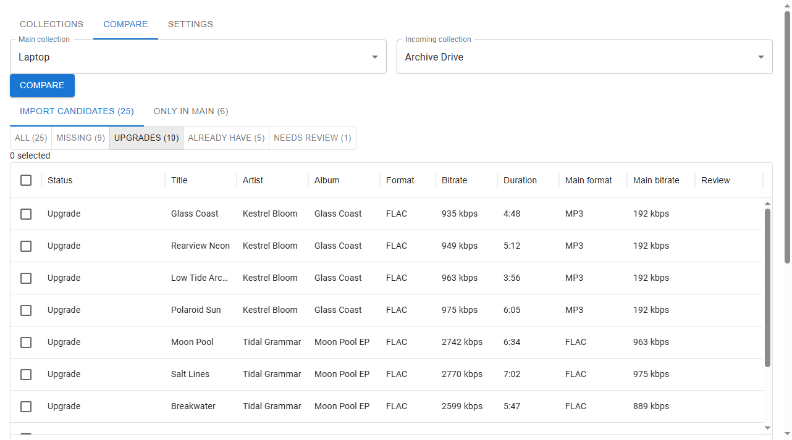

# Music Zamlr

Music Zamlr compares two local music collections. It shows which tracks you do
not have, which tracks exist in better quality in the other collection, and
which tracks you already have. Then it copies only the files you select.



A typical case: you keep your music in two places, for example on a laptop
and on an archive drive. Over the years, the two copies became different. The
archive has tracks that the laptop never received, and better copies of some
tracks, such as FLAC files where the laptop has MP3 files. Music Zamlr finds
those tracks and copies only them.

## See it work

https://github.com/user-attachments/assets/1972c370-2eff-484c-a1f4-564796d93ea8

The video adds two collections, compares them, settles a track that matches
two of your files, and imports nine tracks. The two collections are demo
data: the audio is synthetic, and all artist and track names are invented.
The typing and the waits play faster than real time.

## How it works

Music Zamlr is a desktop program for Windows and Linux. It has two parts. The
window shows the interface. A backend program reads your drives with normal
file operations and keeps a database of your collections. The window starts
the backend when it opens and stops it when it closes.

Both parts run only on your computer. They send nothing over the network.

On macOS, the same program runs from its source code, in a browser. See
[macOS](#macos).

- Window: Tauri
- Backend: FastAPI, SQLModel, SQLite
- Interface: React, TypeScript, MUI, Vite
- Acoustic fingerprints: `fpcalc` from Chromaprint, included in the installer
  and in the Linux package

## Requirements

- On Windows: Windows 10 or Windows 11, 64-bit, and Microsoft Edge WebView2.
  Windows 11 includes WebView2, and most Windows 10 computers have it. If it
  is missing, the installer downloads it. The installation then needs an
  internet connection.
- On Linux: a 64-bit (x86-64) system that installs `.deb` packages, with
  WebKitGTK 4.1. Ubuntu 22.04 or later, Debian 12 or later, and the
  distributions built on them have it. The installation gets WebKitGTK if it
  is missing.
- Both collections must be folders on this computer. An external USB drive is
  enough. Read [A collection keeps its path](#a-collection-keeps-its-path)
  before you use one.
- Audio files in the formats `.mp3`, `.flac`, `.wav`, `.aif` or `.aiff`,
  `.aac`, `.opus`, `.tta`, `.ape`, `.tak`, `.ofr`, `.mpc`, `.wv`, `.wma`,
  `.dsf`, `.dff`, `.m4a`, or `.ogg`. An `.m4a` file must hold ALAC or AAC
  audio, and an `.ogg` file must hold Vorbis, Opus, or FLAC audio. A `.wv`
  file must not hold DSD audio, and a `.wma` file must not hold WMA Pro over
  S/PDIF. The scanner lists a file with other audio inside as a file that it
  cannot read. The scanner ignores all other files and counts them as **Not
  audio**.

## Install

### Windows

1. Open the
   [Releases page](https://github.com/FranciscoJavierCurroAlcalaSoler/music-zamlr/releases).
   Download `music-zamlr_<version>_x64-setup.exe` from the newest release.
2. Run the file. Windows can show a dialog with the title **Windows protected
   your PC**. At first, the dialog has only the button **Don't run**. Select
   **More info**. The dialog then shows **Publisher: Unknown publisher** and a
   second button. Select **Run anyway**.
3. Select **Next**. The installer puts the program in
   `%LOCALAPPDATA%\Music Zamlr`. It installs for your user account only and
   does not ask for administrator rights.
4. On the last page, keep **Run Music Zamlr** selected to start the program.
   Select **Create desktop shortcut** if you want an icon on the desktop.

Windows shows the dialog in step 2 because the installer has no code
signature. A code signature costs money every year, and this project is free.

Start the program from the Start menu.

### Linux

1. Open the
   [Releases page](https://github.com/FranciscoJavierCurroAlcalaSoler/music-zamlr/releases).
   Download `music-zamlr_<version>_amd64.deb` from the newest release.
2. Open a terminal in the folder of the file, and install it:

   ```
   sudo apt install ./music-zamlr_<version>_amd64.deb
   ```

   Keep the `./` at the start. Without it, apt searches its online lists for a
   package with that name and does not find one. apt also installs the
   libraries that the program needs and that are missing.

Start the program from the applications menu, or with the command
`music-zamlr`.

### On both systems

Only one copy of the program runs at a time. If you start it again, the open
window comes to the front.

## Update

The program does not update itself. To update it, download the newer version
from the Releases page and install it in the same way as the first one:

- On Windows, run the newer installer. It replaces the old version.
- On Linux, install the newer package with `sudo apt install`. It replaces the
  old version.

Your collections and your settings stay, because they are in a separate
folder that an installation does not change (see
[Where your data is](#where-your-data-is)). To be safe, make a backup of that
folder before you update.

## Where your data is

The program keeps its data in one folder:

- On Windows: `%APPDATA%\com.zamlr.music`
- On Linux: `~/.local/share/com.zamlr.music`

The folder contains two files:

- `music.db` holds your collections, the scanned tracks, the stored hashes
  and fingerprints, and the order of the formats.
- `music-zamlr.log`, in the `logs` folder, is the log of the backend program.
  Attach it to a bug report.

When the program shows an error, the message gives the path of the log file.
The **Open folder** button next to it opens that folder in the file manager.

To make a backup, close the program and copy the folder. To start again with
no collections, close the program and delete the folder. The import logs are
not in this folder. Each import writes its log into its destination folder.

## Uninstall

### Windows

Open **Settings > Apps** in Windows, select **Music Zamlr**, and then select
**Uninstall**. You can also run the installer again and select **Uninstall
Music Zamlr**.

The uninstaller shows the option **Delete the application data**. It is not
selected, so your data stays in `%APPDATA%\com.zamlr.music`. If you install
the program again later, it finds your collections there. Select the option
to delete that folder too.

### Linux

```
sudo apt remove music-zamlr
```

Your data stays in `~/.local/share/com.zamlr.music`. If you install the
program again later, it finds your collections there. `apt purge` does not
delete that folder either. To delete your data, delete the folder:

```
rm -r ~/.local/share/com.zamlr.music
```

## macOS

Music Zamlr has no installer for macOS. The program runs on macOS from its
source code, in a browser, and it does the same scans, comparisons, and
imports. The automated tests of the backend run on macOS, Linux, and Windows.

To install and start it, obey
[Running from source](CONTRIBUTING.md#running-from-source) in CONTRIBUTING.md.
Two things are different from the desktop program:

- You start the backend and the interface in two terminals, and you open the
  interface in a browser.
- The **Browse…** buttons are only in the desktop window. In a browser, type
  the path of each folder.

## Use

1. Add a collection. Give it a name and the path to its root folder. Select
   **Browse…** to choose the folder. The scanner reads every audio file and
   stores the tags and the technical data.
2. Add the second collection in the same way.
3. Select both collections and start a comparison. The first comparison is the
   slow one, because it reads files to compare them. The tool stores hashes and
   fingerprints in its database, so later comparisons are faster.
4. Examine the result table. Each track belongs to one group: missing, upgrade
   available, already have, needs review, or only in yours.
5. Select the tracks to import. Select a destination folder, a folder
   structure, and what must happen to a file that an upgrade replaces (see
   [What happens to a replaced file](#what-happens-to-a-replaced-file)).
6. Examine the preview. It lists every file operation before anything on disk
   changes.
7. Select **Import**. The tool writes a log file into the destination folder.
   The file is named `import_log_` followed by the date and time, and it
   lists each file operation with its result. It is JSON, and its
   `format_version` key tells a program which layout the file has.

A scan and a comparison both report progress while they run. A large
collection takes minutes.

### A collection keeps its path

A collection stores the path of its root folder when you add it. You cannot
change that path later, and you cannot delete a collection. If Windows gives a
USB drive a different drive letter, or if Linux mounts the drive at a
different folder, the tool cannot scan that collection again. The scan then
fails with the message `Collection path not found. It may not be mounted.`
Add the drive as a new collection, with a different name.

### What happens to a replaced file

Before an import, you select one of three actions for the files that the
upgrades replace:

- **Keep both tracks.** Your file stays where it is. The tool copies the
  better file into the destination folder as a separate file.
- **Move my track aside.** Your file moves into a folder named `_superseded`,
  directly under the destination folder. All moved files go into this one
  folder, without subfolders. If a file with the same name is already there,
  the moved file gets a numbered suffix. You can move a file back by hand.
- **Delete my track.** The tool deletes your file after it writes the better
  copy. You cannot undo this.

If you are not sure that every upgrade is correct, select **Move my track
aside**. It keeps your file, and you can move the file back.

The scanner never reads a folder named `_superseded`, in any letter case and at
any depth in a collection. This keeps moved files out of later comparisons. It
also hides your own folder, if it has this name.

### After an import

A comparison does not know about the imported files until you scan again.
Scan the collection that contains the destination folder. Until then, a new
comparison still shows the imported tracks as missing. If the destination
folder is not in one of your collections, the tool does not show the imported
files.

### Your selection is not saved

If you close the program or reload the window, the program clears the tracks
that you selected and your answers in the review dialog. A new comparison
clears them too. Do a review and its import in one session.

## How the tool decides that two tracks are the same

Three rules do the work. They run in this order, and each rule gets only the
tracks that the rules before it did not resolve.

**Identical file size, then identical hash.** This finds exact duplicates. It
works even when a file has no tags at all. It cannot find a better copy,
because a different encoding almost always has a different file size.

**The sound of the first two minutes.** The tool reads the first two minutes of
each file with `fpcalc` and makes an acoustic fingerprint. It compares two
fingerprints only when the durations of the two tracks are within 2 seconds of
each other. This rule finds a better copy even when the tags are wrong or
blank.

- If the sound differs, the tags cannot overrule it. The track goes to
  **missing**, and the table shows `Missing · audio differs`. The columns
  `Your format` and `Your bitrate` then show the format and bitrate of the file
  that the tool compared.
- If `fpcalc` cannot read a file, or if a file is shorter than about 12
  seconds, this rule gives no answer. The next rule then decides.
- If two of your files have the same sound, the track goes to **needs review**,
  and you decide.
- A remaster can count as a different recording. A remaster can change the
  speed or the balance of the sound, and the fingerprint then changes too. The
  tool then offers the remaster as missing. That is the safe direction: the
  result is an extra copy, not a deleted file.

The tool stores each fingerprint, so `fpcalc` reads a file only one time. If
`fpcalc` is not installed, the tool skips this rule, and a warning appears
above the result table. Without the sound, an upgrade can then be a different
recording of the song.

**Artist, title, and duration.** This rule finds a better copy when the second
rule cannot decide. Artist and title are compared without case or extra
spaces. The durations must be within 2 seconds of each other.

The third rule has two consequences that appear in the result table:

- A track with a blank artist or a blank title is never matched by the third
  rule. The second rule can still match it.
- If two or more of your tracks fall within the 2-second window, the tool does
  not choose one. The track goes to **needs review**, and you decide. An
  obvious duplicate therefore waits for you. The tool never makes an uncertain
  decision on your behalf.

**A file that cannot be read.** A comparison does not stop at a file that it
cannot read. A warning above the result table lists each such file. The tool
compares these tracks by tags only, so an upgrade among them can be a
different recording of the song. A common cause is a file that moved, or that
was deleted, after its scan. Scan the collection of that file again.

## How the tool decides that a copy is better

After the tool pairs your track with a track of theirs, it compares the two
files:

1. The format decides first. The lossless formats (FLAC, ALAC, WAV, AIFF, TTA,
   Monkey's Audio, TAK, OptimFROG, WavPack, and WMA Lossless) and DSD have
   the same rank. The lossy formats (MP3, AAC, Opus, Vorbis, Musepack, WavPack hybrid,
   and WMA) have a lower rank. A file with a higher rank is always better,
   whatever its bitrate. You can change this order. See
   [The order of the formats](#the-order-of-the-formats).
2. If both files are lossless, bit depth and sample rate decide.
   Their file is better only if neither value is lower than yours and at least
   one value is higher. Bitrate does not count here. A lossless bitrate shows
   how well the sound compresses, not how good the sound is.
3. If one file is DSD and the other file is lossless, neither file is better.
   DSD records sound in a different way, so the numbers of the two files do
   not compare. If both files are DSD, the higher sample rate is better.
4. If both files are lossy, the higher bitrate is better.
5. If the two files are equal, you already have the track. If the tool cannot
   read a value that it needs from one of the files, you already have the
   track too. The tool never offers to replace a file whose quality it did not
   measure.

Every upgrade in the table is a file that **Delete my track** removes from your
collection. The rule can be wrong about a track, for example about a file that
was converted to a higher sample rate. The deletion is then permanent.

The rule for lossless files has three consequences:

- A remaster in the same format, bit depth, and sample rate is not offered as
  an upgrade, even if it sounds different.
- If each file is better on a different value, neither file is an upgrade.
  For example, a 24-bit file at 44.1 kHz and a 16-bit file at 96 kHz are not
  upgrades of each other.
- **Known limit.** The rule reads the numbers in the file, not the sound. A
  44.1 kHz recording that was converted to 96 kHz still counts as an upgrade.
  So does a 32-bit float WAV file from an audio editor.

### The order of the formats

The **Settings** tab holds the order of the formats. The tool starts with the
order in rule 1 above, and you can change it.

The formats are in tiers. All the formats in one tier are equally good. A file
in a higher tier is better than a file in a lower tier, whatever its bitrate.
Two files in the same tier go to rules 2 to 5 above.

Each format has two buttons: **↑** moves it to the tier above, **↓** to the
tier below. A format that is alone in the top or the bottom tier does not
move. A format that shares a tier moves out of it into a new tier of its own.
Each tier has its own buttons, **↑ Move tier** and **↓ Move tier**, which move
the whole tier with all its formats.

Select **Save** to store the order. The tool uses the stored order for every
comparison, and also for the comparison that it makes again during an import.
Select **Reset** to go back to the order in rule 1.

Three rules apply to every order:

- **A lossy format and a lossless format are never in the same tier.** A
  bitrate means something different for the two, so the tool blocks the move
  and shows a message. Use **↑ Move tier** to change the position of a whole
  tier.
- **A DSD format can be in a tier with lossless formats.** Rule 3 above still
  applies: a DSD file and a lossless file are never upgrades of each other.
- **A format that a later version of the tool adds** goes into the lowest tier
  of its own kind. A lossless format goes into the lowest lossless tier, and a
  lossy format into the lowest lossy tier. The tab then lists the names of
  these formats. Move them if you want them in a different tier.

A comparison on the screen shows the result of the order that was stored when
it ran. If you store a different order after that, the comparison says that it
is out of date. Select **Compare** again to get current results.

> **Warning.** You can put a lossy tier above a lossless tier. The tool then
> offers a lossy file as an upgrade of a lossless file. With **Delete my
> track**, the import deletes your lossless file. The Settings tab shows a
> warning while the order has a lossy tier above a lossless tier.

## Design notes

**File size comes before tags.** A human compares artist and title first. The
tool does not, because size grouping costs one lookup in memory and works on
untagged files. Hashes are computed only for files that already share a size.

**The sound is compared on your computer.** The tool does not send
fingerprints to an online service such as AcoustID. It works without a network
connection and needs no account. Your files and their fingerprints stay on your
computer.

**The server computes the comparison again at import time.** The request names
the tracks to import, not what they are. A bug in the table can therefore
select the wrong row, but it cannot delete the wrong file. The server holds
its own answer and compares the request against it.

**Progress arrives over Server-Sent Events.** A scan, a comparison, and an
import each send their progress to the interface on one open connection, and
the last message carries the result. Another common design starts the work in
the background, gives it a number, and lets the interface ask about that
number again and again. That design continues if the connection breaks. But
it needs a table of the work that runs, a way to make the numbers, and a rule
that deletes old work. Nothing else in the program needs these, so the program
does not use that design.

**Nothing is overwritten in silence.** Two files with the same destination
name get a numbered suffix, in the way Windows Explorer does it. A file is
deleted only after its replacement is written. An uncertain match goes to you.

**The preview warns before an import that cannot fit.** It compares the free
space on the destination drive against the total size of the files to copy,
plus every file that moves into `_superseded` from a different drive. Such a
move copies the file, so the destination drive holds both your old file and
the better one. The tool warns and lets you continue, because you can clear
space before you confirm.

## Known limits

- The action for a replaced file applies to every upgrade in one import. You
  cannot select a different action for each file.
- The tool identifies a file by its path. If you move or rename a file, the
  tool forgets its stored hash and fingerprint, and the next comparison reads
  the file again. On Windows, this also occurs when only the letter case of a
  name changes.
- The free-space warning in the preview reads the drive letter of a path, not
  the disk behind it. A move into `_superseded` from a different disk needs
  free space, but the warning can count it as free:
  - On Windows, when your destination folder is a mount point for another
    disk.
  - On Linux, always. A Linux path has no drive letter, so the warning never
    counts a move into `_superseded`. Every disk other than the system disk
    is mounted at a folder.
- In a browser on macOS, do not scan one collection from two tabs at the same
  time. The tool does not prevent it, and one of the scans can fail. The
  desktop program cannot do this, because only one copy of it runs.
- A TrueAudio (`.tta`) file reports no bit depth. The tool then cannot compare
  two TTA files of one recording, so you already have the track. The result
  table shows no bitrate for a TTA file.
- The result table shows no bitrate for a Monkey's Audio (`.ape`), TAK,
  OptimFROG (`.ofr`), or WavPack (`.wv`) file. These files report no bitrate. The comparison does not need it, because bit
  depth and sample rate decide between two lossless files.
- `fpcalc` cannot read an OptimFROG file. The tool compares an OptimFROG track
  by artist, title, and duration only. An upgrade to or from an OptimFROG file
  can therefore be a different recording of the song.
- A WavPack hybrid file counts as lossy, even when its correction file
  (`.wvc`) is beside it. The import copies only the `.wv` file, and `fpcalc`
  reads only that file. A hybrid file reports no bitrate, so the tool cannot
  compare two hybrid files of one recording. You then already have the track.
- A WMA Lossless file reports no bit depth. The tool then cannot compare it
  with another lossless file of one recording, so you already have the track.
- `fpcalc` cannot read a DSDIFF (`.dff`) file. The tool compares a DSDIFF track
  by artist, title, and duration only. An upgrade between two DSDIFF files can
  therefore be a different recording of the song.

## Status

Version 0.1.0 is the first release. The scan, the comparison, and the import
all work, and each shows its progress. The comparison uses file hashes,
acoustic fingerprints, and tags. The **Settings** tab holds the order of the
formats.

## License

The source code in this repository is under the MIT license. See
[LICENSE](LICENSE).

The installed program contains parts under other licenses:

- The backend program contains mutagen, which is under the GNU General Public
  License, version 2 or later. The backend program is therefore distributed
  as a whole under the GNU General Public License, version 3 or later. See
  [licenses/GPL-3.0.txt](licenses/GPL-3.0.txt). On Linux, it also contains
  libraries from Ubuntu packages, under permissive licenses.
- `fpcalc` contains FFmpeg. It is under the GNU Lesser General Public License,
  version 2.1. On Windows, it also contains the MinGW-w64 runtime. On Linux,
  it also contains the GNU C Library, under the same license, version 2.1 or
  later.

Each release on the Releases page includes, for each system, the complete
source code of the backend program and of `fpcalc`, and the file
`THIRD-PARTY-NOTICES.txt` with every license text. The installer and the
package also put that file next to the program: on Windows in the
installation folder, on Linux in `/usr/lib/Music Zamlr/`.
